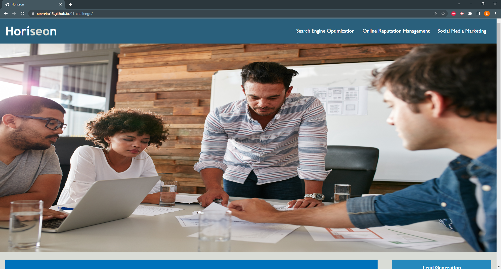

# Horiseon-Refactor-Accessibility-Challenge

## Description

Accessibility refactor of a Horiseon Web Application for the week one challenge of the University of Miami Coding Boot Camp.

## Links

- Deployed application: [https://spereira15.github.io/01-challenge/](https://spereira15.github.io/01-challenge/)
- GitHub repository: [https://github.com/spereira15](https://github.com/spereira15)

## Work Done

- Added more appropiate title.
- Added semantic HTML elements.
- Improved HTML formatting.
- Deleted repetitive CSS.
- Made CSS more concise.
- Rearranged CSS selectors for more logical structure.
- Improved CSS formatting.
- Fixed hyperlink tag by adding missing ID.

## Screenshot

